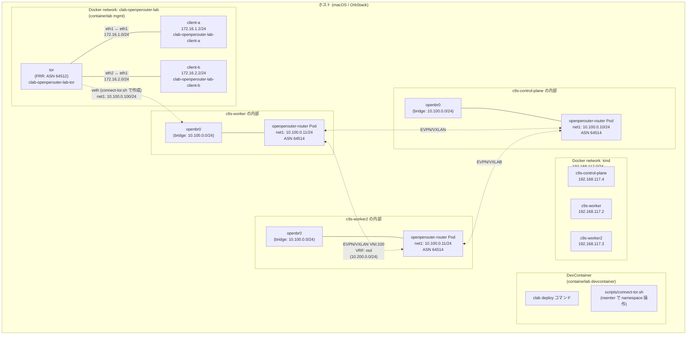

# Open PE Router on Kubernetes Network by Containerlab

## Usage

1. Build DevContainer image
2. Create a Kubernetes cluster using Kind

    ```bash
    kind create cluster --name c9s --config kind/kind-config.yaml
    ```

3. Deploy the Open PE Router on the Kubernetes cluster with Helmfile

    ```bash
    helmfile -f helm/helmfile.yaml apply
    ```

## Components

- [Containerlab](https://containerlab.dev/):  
  A container-based network emulator that allows you to create and manage complex network topologies using containers.
- [Open PE Router](https://openperouter.github.io/):  
  PE routers are used in service provider networks to connect customer edge (CE) devices to the provider's core network. They play a crucial role in routing and forwarding traffic between different customer sites and the provider's network.


