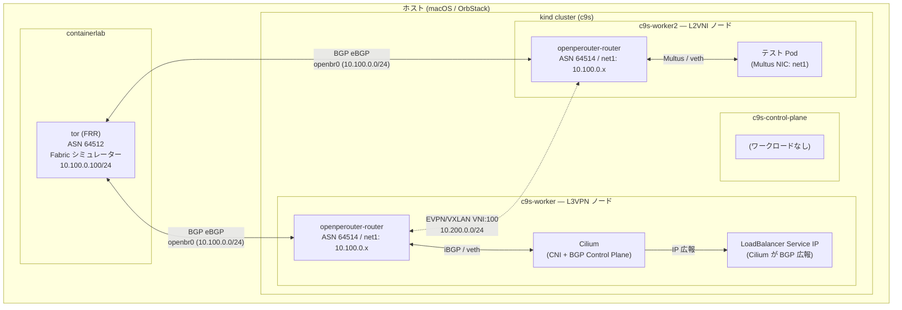

# openperouter 検証環境

kind + containerlab + openperouter を使って L3VPN / L2VNI の動作を検証する環境です。

## 検証目的

| # | シナリオ | 確認内容 |
|---|---------|---------|
| 1 | **L3VPN** | Cilium BGP CP が広報した Service IP が、openperouter 経由で Fabric (tor) の BGP テーブルに届くか |
| 2 | **L2VNI** | Multus NIC を持つ Pod が、openperouter 経由で Fabric (tor) に L2 延伸されるか |

## アーキテクチャ



## ファイル構成

```
.
├── .devcontainer/
│   └── devcontainer.json       # 開発環境 (kubectl / helm / clab 入り)
├── helm/
│   └── helmfile.yaml           # openperouter / Cilium / multus のインストール
├── kind/
│   └── kind-config.yaml        # kind クラスター設定 (Cilium 用に defaultCNI 無効)
├── manifests/
│   ├── network/
│   │   ├── install-cni-plugins.yaml  # multus が使う bridge プラグインを各ノードにインストール
│   │   └── nad.yaml                  # multus NetworkAttachmentDefinition (openbr0)
│   └── openpe/
│       ├── underlay.yaml       # BGP アンダーレイ設定 (tor との eBGP)
│       ├── l3vni.yaml          # L3VPN 用 VNI 設定
│       └── l2vni.yaml          # L2VNI 用 VNI 設定
├── scripts/
│   └── connect-tor.sh          # tor コンテナを各 kind ノードの openbr0 に接続
└── topology/
    └── oper-sample01.yaml      # containerlab トポロジー (tor / client-a / client-b)
```

## 前提条件

- Docker (OrbStack)
- kind
- helm / helmfile
- containerlab (DevContainer 内に含まれる)
- kubectl

---

## 環境構築手順

### Step 1: kind クラスターの作成

Cilium を CNI として使うため `disableDefaultCNI: true` を指定する。

```bash
kind create cluster --name c9s --config kind/kind-config.yaml
```

> クラスター作成直後は Cilium 未インストールのため Node が NotReady になる。Step 2 完了後に Ready になる。

### Step 2: コンポーネントのインストール

```bash
helmfile sync -f helm/helmfile.yaml
```

インストールされるコンポーネント:

| リリース名 | namespace | 役割 |
|-----------|-----------|------|
| cilium | kube-system | CNI + BGP Control Plane |
| openperouter | openperouter-system | PE ルーター operator |

> multus と ipamclaims は helm chart がないため helmfile の presync hook で `kubectl apply` する。

### Step 3: Network マニフェストの適用

```bash
# bridge CNI プラグインを全ノードにインストール
kubectl apply -f manifests/network/install-cni-plugins.yaml

# multus NAD (openbr0 ブリッジ定義)
kubectl apply -f manifests/network/nad.yaml

# BGP アンダーレイ (tor との eBGP ピア設定)
kubectl apply -f manifests/openpe/underlay.yaml
```

### Step 4: containerlab トポロジーの起動

DevContainer を開き、以下を実行する。

```bash
clab deploy -t topology/oper-sample01.yaml
```

### Step 5: tor を openbr0 に接続

tor コンテナ (containerlab) と openperouter のブリッジ (kind ノード内の openbr0) は
異なる Docker コンテナの network namespace にあるため、veth ペアで接続する。

```bash
sudo ./scripts/connect-tor.sh
```

> DevContainer は `--pid=host` / `--privileged` で動作しているため、
> `nsenter` で kind ノードの network namespace に入ることができる。

---

## 検証① L3VPN

### 概要

```
Cilium BGP CP --iBGP/veth--> openperouter --EVPN--> tor (FRR)
```

Cilium BGP Control Plane が LoadBalancer Service IP を openperouter に広報し、
tor の BGP テーブルで到達を確認する。

### 手順

```bash
# L3VNI CRD を適用
kubectl apply -f manifests/openpe/l3vni.yaml

# Cilium BGP ピアリングポリシーを適用
kubectl apply -f manifests/cilium/bgp-peering.yaml

# BGP 疎通確認 (tor 側)
docker exec clab-openperouter-lab-tor vtysh -c "show bgp summary"
docker exec clab-openperouter-lab-tor vtysh -c "show bgp ipv4 unicast"
```

### 期待する結果

- tor の BGP テーブルに LoadBalancer Service IP が現れる
- openperouter router Pod の FRR で Neighbor が Established になる

---

## 検証② L2VNI

### 概要

```
テスト Pod (Multus NIC) --veth--> openperouter --EVPN--> tor (FRR)
```

Multus NIC を持つ Pod が openperouter 経由で tor と L2 疎通できることを確認する。

### 手順

```bash
# L2VNI CRD を適用
kubectl apply -f manifests/openpe/l2vni.yaml

# Multus NIC 付きテスト Pod をデプロイ
kubectl apply -f manifests/network/test-pod.yaml

# tor 側で Pod の MAC が EVPN に現れるか確認
docker exec clab-openperouter-lab-tor vtysh -c "show evpn mac vni all"

# tor の client-a から Pod IP への疎通確認
docker exec clab-openperouter-lab-client-a ping <Pod-IP>
```

### 期待する結果

- tor で `show evpn mac vni all` に Pod の MAC が表示される
- client-a から Pod IP への ping が通る

---

## クリーンアップ

```bash
# tor の接続解除
sudo ./scripts/connect-tor.sh cleanup

# containerlab 停止
clab destroy -t topology/oper-sample01.yaml

# kind クラスター削除
kind delete cluster --name c9s
```
